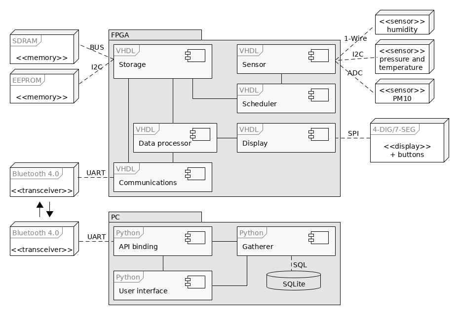

# SPSP
Particulate matter pollution monitoring system (:poland: System Pomiaru Stężenia Pyłu w powietrzu )

This repository contains my bachelor of engineering project.

## Purpose

The main goal of this project was to build a standalone air/weather monitoring station while at the same time learning as much as possible about digital electronics and FPGAs.

## Overall structure and points of interest

The project is split into five parts:
* [device programming (FPGA configuration) in VHDL (Quartus Prime LE 17.2)](src/vhdl)
* [archiver and user interface in Python (3.x)](src/python)
* [device API binding for Python](src/python/API)
* [custom PCBs designed for the project (KiCad 5.x)](hardware)
* [intermediate build stages of the device programming with "unit" test benches](src/vhdl-dev)

## System architecture

## Device component layout

## Hardware used (BOM)

The measurement device was built using the following parts:

Element name | Spec | Qty
--- | --- | ---
DE0-Nano | Cyclone® IV EP4CE22F17C6N | 1 
Bluetooth module | RN4020-V/RM | 1
Humidity sensor | DHT11 | 1
Pressure sensor | LPS331AP | 1
Optical dust sensor | GP2Y1010AU0F | 1
4x8-segment display | FJ5461BH, 14mm red | 1
8 bit shift register | 74HC595 | 1
Multiplexer (3x2ch) | 74HCT4053 | 2
Tact switch | 6x6mm, h=8.0mm | 2
Electrolytic capacitor | 220uF 35V, 8x12 | 1
1206 monolithic capacitor | 100nF 50V | 1
1206 resistor |  150R, 0.25W | 1
1206 resistor |  220R, 0.25W | 4
1206 resistor |  4k7R, 0.25W | 1
PCB connector | LPH-14S/SCP-14P | 1
PCB connector | LPH-16S/SCP-16P | 1
Idc connector | FC-14, 1,27mm pitch | 2
Idc connector | FC-16, 1,27mm pitch | 2
Flat cable | 10x28AWG, 1,27mm pitch | 1 roll
