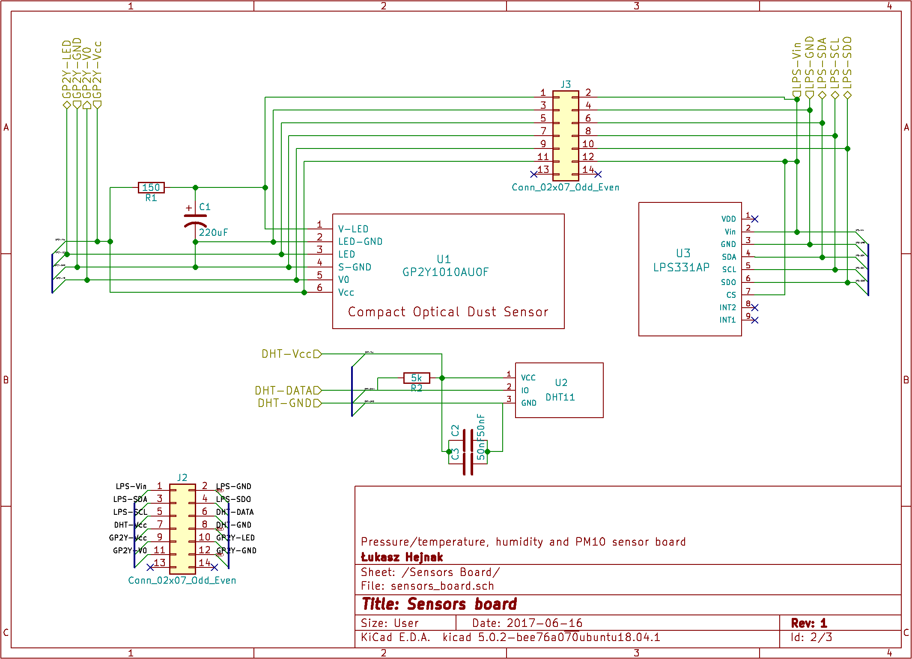
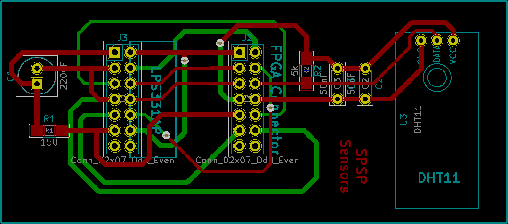
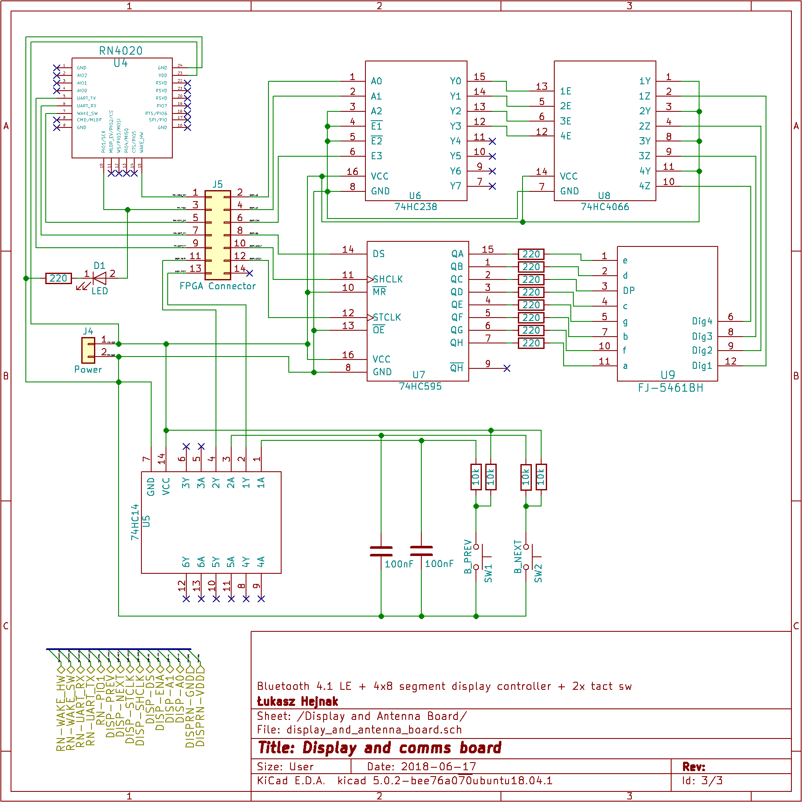
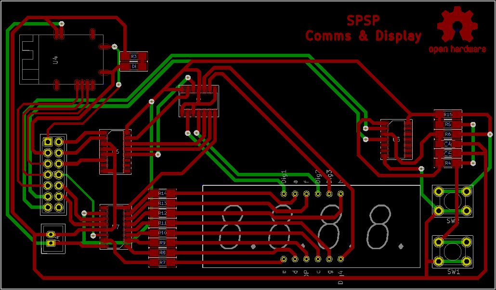

# SPSP - Hardware

One of the goals of the project was to make it modular and easily fittable into a housing (in order to protect the electronics from weather elements).  
Therefore I designed two easily detachable (via flat cable) PCBs:
* sensors PCB - for all the sensors to be joined together (excluding the PM10 sensor, which is attached via a separate cable, due to the nature of PM10 measurements)
* display and comms PCB - for the display (of own design), input switches and a communications module

### Sensors

  
  

### Display and comms

  

