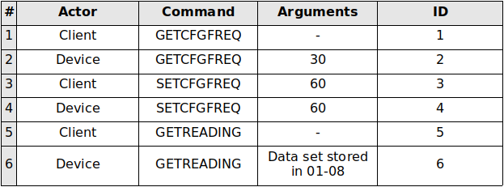
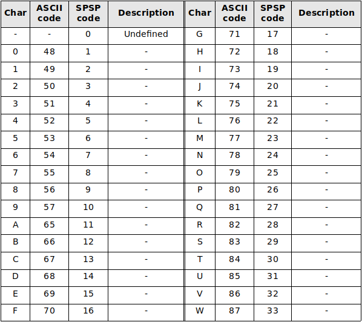
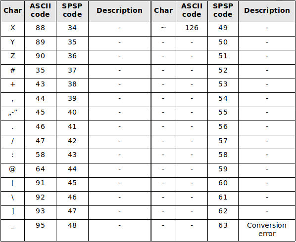

### API Command internals
In order to send an API command, one must:
* connect to the device
* pick the BT *command* channel (uuid: 0cc3e289-7a82-448e-bd8b-9d3552f5380a)
* put the command in the channel with an ID number (see below)
* wait till the ID field is incremented by 1 (meaning that the device responded)
* parse the channel contents to get the response

Command structure (20 bytes):  

:i: Every command is exactly 10 bytes. If a command is shorter, the row must be padded with zeroes.

Command flow example:  

### Available commands
The following commands are available:
| Command (10 bytes) | Arguments (8 bytes) | Description |
| --- | --- | --- |
| GETCFGPM10 | int [8 bits] | ... |
| GETCFGFREQ | int [8 bits] | ... |
| GETCFGSAMP | int [6 bits] | ... |
| GETBTNAME | SPSP (see below) | ... |
| GETPRESSPT | int [8 bits] | ... |
| GETDISPOFF | int [6 bits] | ... |
| SETCFGPM10 | int [8 bits] | ... |
| SETCFGFREQ | int [8 bits] | ... |
| SETCFGSAMP | int [6 bits] | ... |
| SETBTNAME | SPSP (see below) | ... |
| SETPRESSPT | int [8 bits] | ... |
| SETDISPOFF | int [6 bits] | ... |
| GETTMSTAMP | - | ... |
| GETREADING | - | ... |
| GETSTORED | int [20 bits] | ... |
| RESETUID | - | ... |
| RESETCFG | - | ... |

#### SPSP encoding
Due to limited resources for some commands (marked above) we decided to use our own 6bit encoding instead of the traditional 8bit variant. Therefore in order to send and receive commands from the device, one must apply additional I/O translation according this table:  

Also see the available implementations:
* converting ASCII to SPSP argument encoding: API.BTHandler.str2bit()
* converting SPSP argument encoding to ASCII: API.BTHandler.bit2str()
