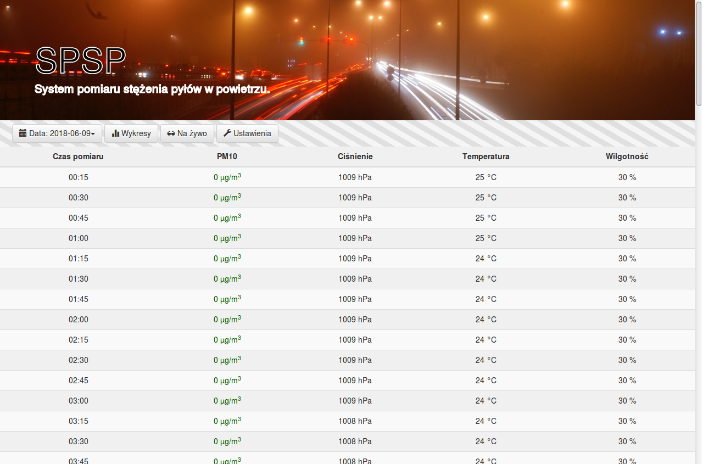
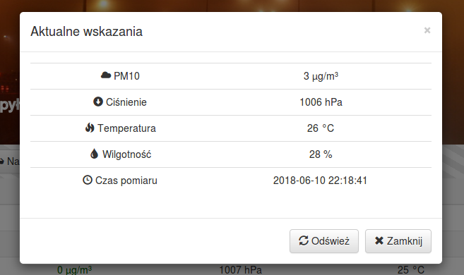
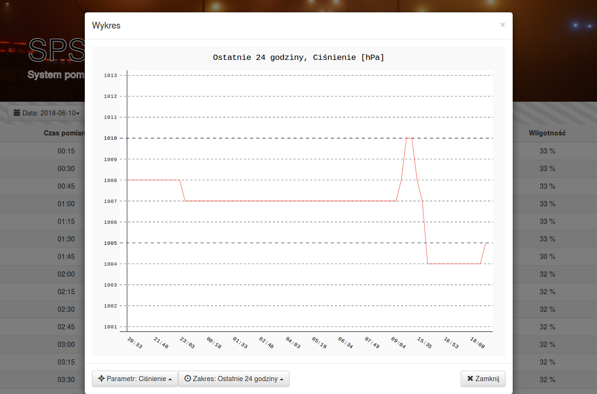
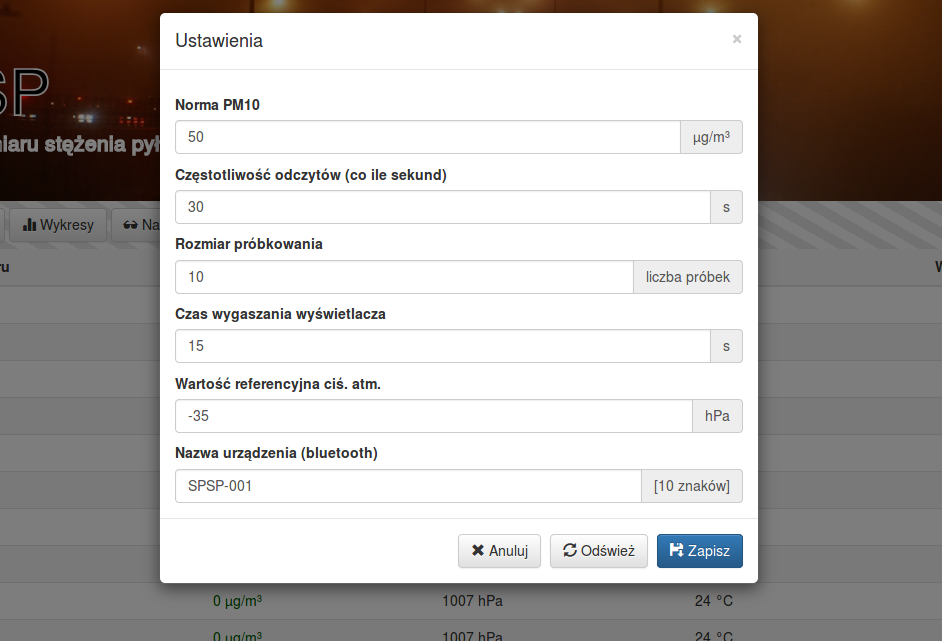

# SPSP - User Interface

## Building

### Prerequisites
Before starting make sure you have pyenv and python 3.6.8 installed.
If you don't, try the following steps:

* Install pyenv
  ```sh
  curl https://pyenv.run | bash
  ```

* Setup the pyenv environment (you can add it to your ~/.bash_profile, to have it load automatically)
  ```sh
  export PATH="$HOME/.pyenv/bin:$PATH"
  eval "$(pyenv init -)"
  eval "$(pyenv virtualenv-init -)"
  ```

* Install the python version:
  ```sh
  pyenv install 3.7.2
  ```

For this step to complete you may need some system dependencies: 
zlib-devel bzip2 bzip2-devel readline-devel sqlite sqlite-devel openssl-devel xz xz-devel libffi-devel libzbar-dev

### Setting up the project

* clone it
* configure the venv:
  ```sh
  cd SPSP/src/python
  pyenv local 3.7.2
  python -m venv env/
  source env/bin/activate
  ```
* install the python dependencies and create an initial DB:
  ```sh
  pip install -U setuptools pip
  pip install -e .
  ```
* build the bluepy helper binary (only if env/lib/python3.7/site-packages/bluepy/bluepy-helper is not present):
  ```sh
  cd env/lib/python3.7/site-packages/bluepy/
  make
  ```
* plug in and configure your device, e.g.:
  ```sh
  python scripts/setup.py --addr AA:BB:CC:DD:EE:FF --code SPSP
  ```

## Running

### WebServer
First always remember to activate the virtual env:
```sh
cd SPSP/src/python
source env/bin/activate
```

For single-user development purposes, it should be enough to do:
```sh
DEBUG_MODE=1 ./manage.py runserver 127.0.0.1:8888
```

For production (or multi-user development) instances you should setup a webserver (e.g. Nginx)
and configure it to run via uwsgi or a similar solution. 

### UI
Open your favourite browser and navigate to 127.0.0.1:8888

Here are the 4 main parts of the UI:
* readings table:  
  

* live view:  
  

* charts:  
  

* settings:  
  

### Data fetching
In order to fetch measurement data from the device, one must call:
```sh
python scripts/direct_run.py --code SPSP-001
```
Optimally, this should be put in a cronjob somewhere so that the latest data is fetched e.g. every 10 minutes.
Don't worry about missing any measurements. The system will always start from the latest
fetch and continue until it catches up with the latest readings.

### API binding for Python
See the code at [src/python/API](API).
