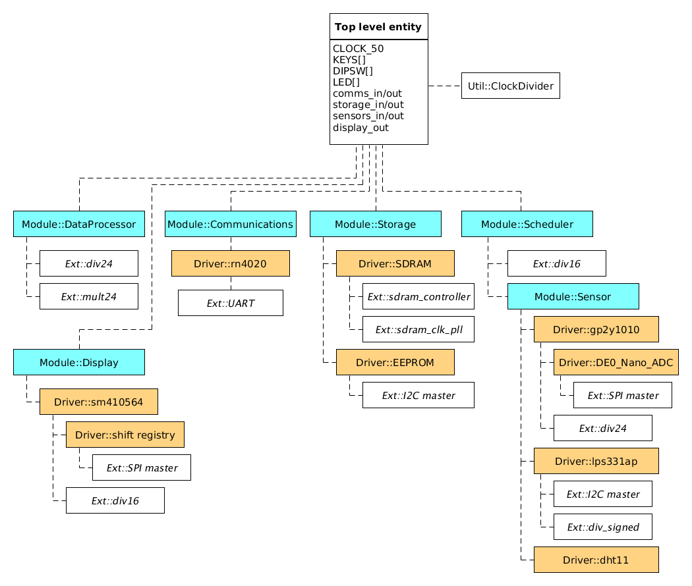

# SPSP - Firmware

### Code layout :zap:

dir | entity | description
--- | --- | ---
drivers | | low level code interfacing directly with the external devices
:small_blue_diamond: | de0nano_adc | reads data from the DE0Nano Analog to Digital converter, used for reading PM10 levels (analog) using SPI
:small_blue_diamond: | dht11 | drives the humidity sensor using a custom 1-wire interface
:small_blue_diamond: | eeprom | drives the internal EEPROM memory of DE0Nano using I²C
:small_blue_diamond: | gp2y1010 | drives the PM10 sensor directly
:small_blue_diamond: | lps331ap | drives from the pressure and temperature sensor using I²C
:small_blue_diamond: | rn4020 | drives the Bluetooth transceiver using UART
:small_blue_diamond: | sdram | drives the internal SDRAM memory of DE0Nano
:small_blue_diamond: | shift_reg | used by sm410564 driver to control the display using SPI
:small_blue_diamond: | sm410564 | drives the display directly
ext | | external code and modules, usually from Quartus or eewiki
:small_blue_diamond: | mult, div | arithmetic multiplication and division modules (signed 24 bit, unsigned 24 bit and unsigned 16 bit)
:small_blue_diamond: | sdram_clk_pll | SDRAM clock signal generator (100MHz and 100Mhz + 4us)
:small_blue_diamond: | i2c_master | Inter-integrated Circuit Protocol (I²C) implementation
:small_blue_diamond: | spi master | Serial Peripheral Interface (SPI) implementation
:small_blue_diamond: | uart | UART implementation
modules | | implement main system operation logic
:small_blue_diamond: | Sensors | Interfacing with the sensor drivers, fetching data on request.
:small_blue_diamond: | DataProcessor | Aggregating data from the sensors, calculating PM10 readout to norm relation (%).
:small_blue_diamond: | Scheduler | Triggering the data collection process at given intervals.
:small_blue_diamond: | Storage | Reading and writing data to the SDRAM (data) and EEPROM (settings) memory, as well as managing the "factory defaults" for settings.
:small_blue_diamond: | Display | Displaying the most up-to-date data in a one-by-one fashion (on demand).
:small_blue_diamond: | Communications | Handling API requests over Bluetooth.
simulation | | integration tests using ModelSim
utils | |
:small_blue_diamond: | clock_divider | clock divider used by drivers to generate different clock signals from DE0Nano's internal 50MHz
:small_blue_diamond: | types | internal data structure definitions and some helper methods for type conversion

### Entity diagram

